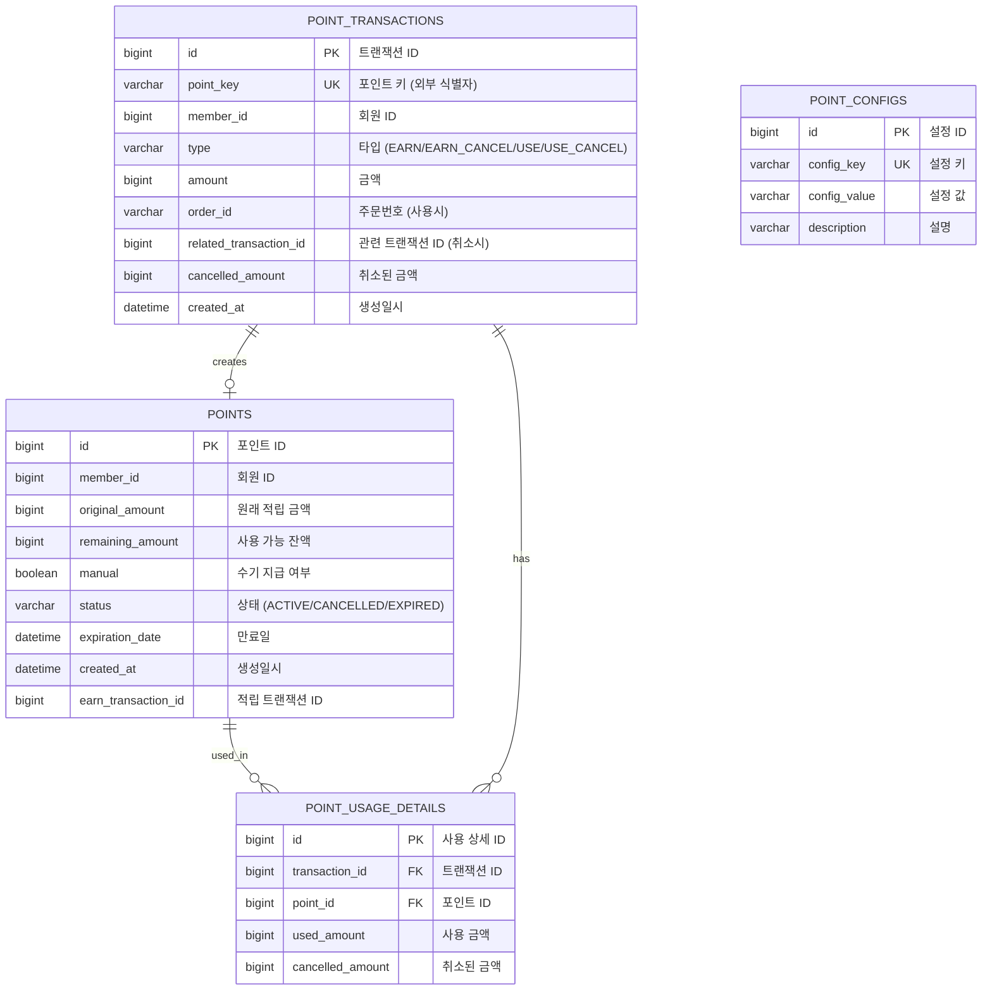

# Point System ERD

## ERD Diagram

## Table Descriptions

### POINTS (포인트)
적립된 포인트 단위를 관리하는 테이블

| Column | Type | Description |
|--------|------|-------------|
| id | BIGINT | Primary Key |
| member_id | BIGINT | 회원 ID |
| original_amount | BIGINT | 원래 적립 금액 |
| remaining_amount | BIGINT | 사용 가능 잔액 |
| manual | BOOLEAN | 수기 지급 여부 (true: 관리자 수기 지급) |
| status | VARCHAR | 상태 (ACTIVE, CANCELLED, EXPIRED) |
| expiration_date | DATETIME | 만료일 |
| created_at | DATETIME | 생성일시 |
| earn_transaction_id | BIGINT | 적립 트랜잭션 ID |

### POINT_TRANSACTIONS (포인트 트랜잭션)
포인트 적립/사용/취소 이력을 관리하는 테이블

| Column | Type | Description |
|--------|------|-------------|
| id | BIGINT | Primary Key |
| point_key | VARCHAR | 외부 식별자 (Unique) |
| member_id | BIGINT | 회원 ID |
| type | VARCHAR | 트랜잭션 타입 (EARN, EARN_CANCEL, USE, USE_CANCEL) |
| amount | BIGINT | 금액 |
| order_id | VARCHAR | 주문번호 (사용 시) |
| related_transaction_id | BIGINT | 관련 트랜잭션 ID (취소 시 원본 트랜잭션) |
| cancelled_amount | BIGINT | 취소된 금액 |
| created_at | DATETIME | 생성일시 |

### POINT_USAGE_DETAILS (포인트 사용 상세)
포인트 사용 시 어떤 포인트에서 얼마를 사용했는지 추적하는 테이블

| Column | Type | Description |
|--------|------|-------------|
| id | BIGINT | Primary Key |
| transaction_id | BIGINT | 사용 트랜잭션 ID (FK) |
| point_id | BIGINT | 사용된 포인트 ID (FK) |
| used_amount | BIGINT | 사용 금액 |
| cancelled_amount | BIGINT | 취소된 금액 |

### POINT_CONFIGS (포인트 설정)
포인트 관련 설정을 관리하는 테이블

| Column | Type | Description |
|--------|------|-------------|
| id | BIGINT | Primary Key |
| config_key | VARCHAR | 설정 키 (Unique) |
| config_value | VARCHAR | 설정 값 |
| description | VARCHAR | 설명 |

## Indexes

### POINTS
- `idx_point_member_status` (member_id, status)
- `idx_point_expiration` (expiration_date)

### POINT_TRANSACTIONS
- `idx_transaction_member` (member_id)
- `idx_transaction_point_key` (point_key)
- `idx_transaction_order_id` (order_id)

### POINT_USAGE_DETAILS
- `idx_usage_detail_point` (point_id)
- `idx_usage_detail_transaction` (transaction_id)

## Relationships

1. **POINTS - POINT_USAGE_DETAILS**: 1:N
   - 하나의 포인트가 여러 사용 건에서 사용될 수 있음

2. **POINT_TRANSACTIONS - POINT_USAGE_DETAILS**: 1:N
   - 하나의 사용 트랜잭션에서 여러 포인트를 사용할 수 있음

3. **POINT_TRANSACTIONS - POINTS**: 1:1
   - 적립 트랜잭션 당 하나의 포인트가 생성됨
